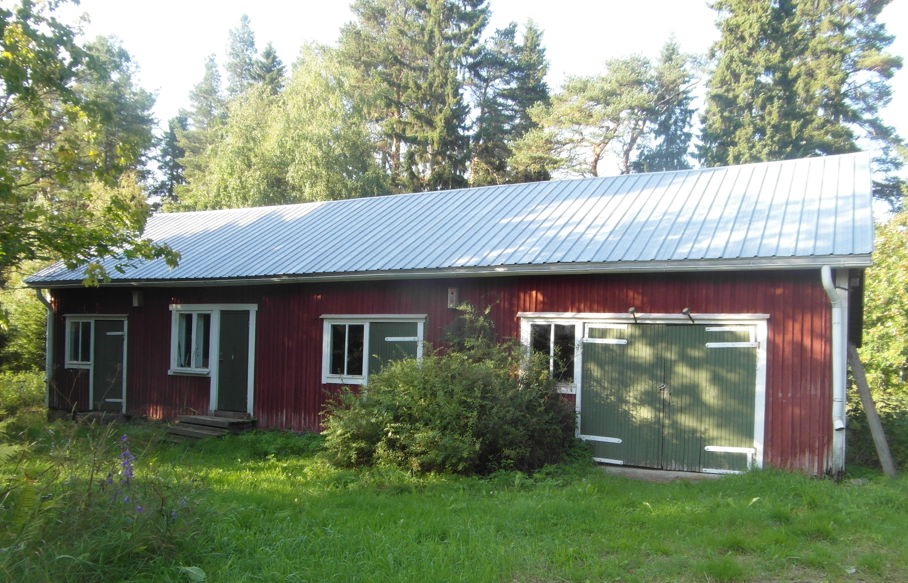

# TIEDOTUSKESKUKSEN RESIDENSSI

• Tiedotuskeskus Hanhikiven tuen resurssien mukaan

• tapahtumia ja tilaisuuksia Pyhäjoella ja lähialueella, joiden yhteydessä toteuttaa taidetta ja tutkimusta, kerätä ja jakaa tietoa

• pihapiirin, jossa toteuttaa ekologisesti kestävään elämäntapaan perustuvia kokeiluja

• naapurisopua, luontoa ja eläimiä kunnioittavaa toimintaa

• ilmapiiriä, joka kannustaa kansalaisia keräämään itse tietoa ja toimimaan aktiivisesti

• asennetta, jossa kaikki ovat tasa-arvoisia oppijoita, kokemuksen ja tiedon jakajia

• verkkosivut, joiden kautta tuoda esille ydinvoimakriittistä tietoa

Osuuskunta Noidanlukolla ei ole palkattua työvoimaa, se ei voi luvata taloudellista tukea ja kukin projektia toteuttava taho on viime kädessä itse vastuussa tekemästään työstä.

