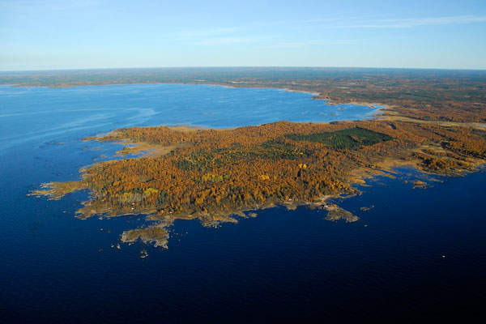

# ROSATOMIN SUURISUUNTAISET HANKKEET EIVÄT EHKÄ TOTEUDU KOSKAAN

## Rosatomilla on vireillä paljon, mutta tekeillä vähän
Eri lähteiden mukaan Rosatomilla on vireillä 35–36 hanketta Venäjän ulkopuolella. Yhtiöllä on tapana liioitella ulkomaalaista portfoliotaan, jotta se vaikuttaisi vahvemmalta ja voimakkaammalta. Venäjä tekee eritasoista atomiyhteistyötä monien Etelä-Amerikan ja Saharan eteläpuolisten Afrikan maiden kanssa. Lopullisena tavoitteena on esimerkiksi kaivosyhteistyö tai ydinvoimalan myyminen. Sopimuksia on yli 20 maan kanssa, mutta rakentaminen on käynnissä viidessä maassa.

Vuonna 2017 Rosatom allekirjoitti 30 miljardin dollarin kaupan Egyptin kanssa rakentaakseen El Daaban neljän reaktorin ydinvoimalayksikön. Vuonna 2018 yhtiö puolestaan sopi neljän reaktoriyksikön kaupasta Kiinaan ja kahden yksikön myymisestä Uzbekistaniin. Turkissa Akkuyun ydinvoimalan rakennustyöt alkoivat huhtikuussa 2018 ja Bangladeshin toisen Rooppurin ydinvoimalayksikön heinäkuussa 2018. Tämän lisäksi kaksi venäläistä ydinvoimalaa yhdistettiin sähköverkkoon vuonna 2018.

Rosatom pystyy tarjoamaan atomimiilujen ostajille edullisia lainoja Venäjän valtion takaamana.  Esimerkiksi Bangladeshin hankkeessa Venäjän laina kattaa 90 % budjetoidusta ydinvoimalan rakentamiskustannuksista. Rooppurin voimalayksiköiden arvioidaan maksavan 15,65 miljardia dollaria, josta venäläinen velka kattaa 11,85 miljardia dollaria. Rosatomin ja Venäjän politiikkaa kuvaa se, että Bangladeshille tarjottava venäläinen laina muodostaa puolet tämän kehittyvän maan ulkomaanvelasta.

Egyptin suurisuuntaisen atomihankkeen, El Daaban voimalan on arvioitu maksavan 60 miljardia dollaria, josta puolet reaktorikustannuksia. Venäjä on jo luvannut projektille 25 miljardin dollarin lainan, joka maksettaisiin takaisin 22 vuoden aikana alkaen vuonna 2029. Unkarissa on jopa puhuttu sadan prosentin venäläislainasta. Sitä on tarjottu vaihtoehdoksi 10 miljardin (noin 80 % kokonaiskustannuksista) dollarin velasta, joka pitäisi maksaa takaisin vuonna 2026 riippumatta siitä tuottaako ydinvoimala sähköä tuolloin vai ei. 

Pääomavaltaisten, kallista ja jäykkää energiantuotantomuotoa edustavien ydinvoimaloiden myyminen ei ole helppoa puuhaa ja se on melko byrokraatista, joten sopimuksesta rakentamisen aloittamiseen kuuluu aikaa. Rosatom levittää toistuvasti harhaanjohtavaa tietoa suuresta määrästä käynnissä olevista hankkeista, jotka eivät pääse alkua pidemmälle tai joiden toteuttaminen myöhästyy vuodesta toiseen. On ilmeistä, että tällä viestinnällä halutaan luoda käsitys (venäläisestä) ydinvoimasta kovin suosittuna energiamuotona.

Suomen Hanhikiven tapauksessa Rosatomin edustaja vakuutti vielä maaliskuussa 2018 uutistoimisto Reutersille, että voimala tuottaa sähköä vuonna 2024, niin kuin alun perin on luvattu. Lisäksi Rosatomista viestitettiin, että yhtiö on valmis käsittelemään kaikki ennalta-arvaamattomat ongelmatilanteet ja sopeutumaan niihin. Kuitenkin myöhemmin samana vuonna venäläisyhtiö arvioi Fennnovoiman voimalan olevan sähköverkossa neljä vuotta myöhässä, vuonna 2028.

## Mitä taloudellisia ja poliittisia vaikutuksia Venäjän atomipolitiikalla voi olla?

Ydinvoima – kuten muutoinkin energiantuotanto – on Venäjälle strategista omistusta. Sillä ajetaan sekä taloudellisia että poliittisia päämääriä. Venäläisten reaktoreiden turvallisuutta on epäilty ja pelätty niiden heikentävän vakautta. Suomessa kannattaisi olla tällä hetkellä enemmän huolissaan Arevan EPR-pilottireaktorin, OL3:n mahdollisesta käynnistämisestä. Ainoatakaan EPR-pilottireaktoria ei ole saatu valmiiksi ja käyntiin: Ei Suomen Olkiluoto 3:a eikä Ranskan Flamanville 3. Rosatom on sentään saanut parannellun VVER-1200 käyntiin Leningrad 2:ssa. Ranskalaisetkin ovat onnistuneet Kiinassa käynnistämään vahvasti parannellun ERP:n (Taishan 1 & 2). Kiinassa ja Venäjällä ydinreaktoriongelmista ei tiedoteta erityisen avoimesti, joten varmuutta niiden sujuvasta toimivuudesta ei ole.

Rosatomin vaikutus ydinvoimariskeihin liittyy lähinnä turvallisuuskulttuuriin – ei niinkään itse teknisiin laitteisiin. Venäjää myy mielellään atomiteknologiaa maihin, joissa on epävakaat olosuhteet, epävakaa maaperä ja kiinnostus ydinaseiden valmistamiseen. Venäjällä suhtautuminen turvallisuusriskejä aiheuttavaan teknologiaan lienee hieman leväperäisempää kuin lännessä, jossa kansalaisjärjestöt ja lehdistö seuraavat alan toimijoita. 

Pohjimmiltaan atomivoiman riskejä ei voida millään teknisillä uudistuksilla koskaan poistaa, koska kyseessä on riskiteknologia, joka ei kypsy koskaan. Se on verrannollinen lentokoneteknologiaan, jossa säätöjärjestelmän avulla pidetään epävakaa systeemi ilmassa – siksi koneita putoilee aina silloin tällöin. Poliittisesti ja taloudellisesti atomiteollisuus muistuttaa finanssialaa, jossa riskit on aina loppujen lopuksi sosialisoitu veronmaksajille: ”Too Big to Fail!”

Venäjä pelaa kuitenkin aikamoista taloudellista hazardipeliä lainaamalla avokätisesti atomivoimahankkeisiin venäläistä rahaa edullisin ehdoin. Mistä varat tarkalleen ottaen tulevat, ei ole aivan selvää, koska ydinvoima-asioissa ei olla erityisen avoimia. Todennäköisesti ainakin osa varoista tulee Rosatomin ja Kremlin oman pankin, Sberbankin kautta. Suomen Hanhikiven 2,4 miljardin euron venäläinen pääoma on peräisin eläkejärjestelmästä, Venäjä hyvinvointirahastosta. Venäjä on sitoutunut noin 90 miljardin dollarin edestä luotottamaan ja sijoittamaan ydinvoimahankkeisiin maan ulkopuolella. Isolla valtiolla on tietenkin enemmänkin varoja ja luonnonvaroja, joilla valuuttaa voi hankkia lisää. Maan elinkeinoelämä pohjautuu kuitenkin vanhan teollisen maailman innovaatioihin, jotka ovat tulossa tiensä päähän seuraavien vuosikymmenten aikana.

Turkissa venäläisyhtiö noudattaa erityisen kallista liiketoimintamallia rakentamalla Akkuyun ydinvoimalaa ns. BOO (Build-Own-Operate) -mallilla. Ydinvoimalan rakentaa, omistaa ja käyttää Rosatom, jolle Turkin valtio on taannut takuuhinnan. Voimalan hinta on yli 20 miljardia euroa. Jopa venäläisten asiantuntijoiden mukaan Rosatom tuskin tulee käyttämään kallista BOO-mallia enää atomimyllykaupoissa. Todennäköisesti siksi Jordania perui voimalahankkeensa. Nyt Rosatom kauppaa aurinkoiseen ja konfliktialueiden ympäröimään Lähi-idän maahan muodikkaita pienydinvoimaloita (Small Modular Reactor,SMR).

Geopoliittisesti huolestuttavin on Turkin Akkuyun ydinvoimalan BOO-malli, jossa Rosatom toimii vieraalla maaperällä voimalan omistajana ja operaattorina. Tähän ovat kiinnittäneet huomiota myös eräät yhdysvaltalaiset ydinturva-asiantuntijat. Nato-maassa (ja maanjäristyksien riskialueella) sijaitseva venäläinen ”rauhanomainen” atomivoimala ei ole juuri herättänyt huolta länsimaissa, vaikka se antaa Venäjälle hyvän (teko)syyn tulla Turkkiin ”puolustamaan” omaisuuttaan. Suomen Hanhikiven malli on myös (geo)poliittisesti ongelmallinen, koska venäläiset omistavat Fennovoimasta leijonanosan (34%). Lisäksi se on rahoitettu venäläisten eläkevaroilla, jolloin intressi puolustaa omistusta on suuri.

Yleisesti ottaen ydinvoimalat eivät ole Venäjälle poliittisen painostuksen kannalta niin tärkeitä kuin kaasu- ja öljytoimitukset. Jo Neuvostoliitto käytti energiatoimitusten katkaisemista mm. Baltian maiden itsenäisyyspyrkimysten estämiseksi. Ydinvoimabisnes on osa laajempaa poliittista ja taloudellista yhteistyötä ja vaikutusvaltaa, jolla alan teollisuus – myös sotilaalliset sovellukset – pyritään pitämään elinvoimaisena. ”Rauhanomaisen” atomivoiman kylkijäisenä voidaan kaupata tehokkaammin myös aseita – kuten esimerkiksi Turkissa, Kiinassa ja Bangladeshissa.

Venäjän vaikutusvalta näkyy nimenomaan siinä, miten se pystyy houkuttelulla, painostuksella ja kiristämisellä edistämään Rosatomin etuja. Suomessa Fortum otti lusikan kauniiseen käteensä ja teki niin kuin Venäjän valtio (ja Suomen hallitus) halusi ja päätti vastoin omaa strategiaansa ja pörssitiedotteittaan osallistua Hanhikivi 1 -projektiin. Pelinappuloina olivat Fortumin venäläiset investoinnit. Avoimen markkinatalouden tasoa ydinvoima-asioissa kuvastaa se, että Helsingin pörssi julisti Fennovoima-asian mahdolliset kurinpidolliset toimet Fortumia vastaan ei-julkiseksi tiedoksi. 

Rosatom on ryhtynyt jopa uusiutuvien energianlähteiden kehittäjäksi Venäjällä, mutta sen päätuote on vahvasti ydinteknologia kaikissa muodoissaan, sekä ”rauhanomainen ydinvoima että ydinaseet. Koska eurooppalainen ydinvoimateollisuus on Ranskan johdolla päätynyt sekavaan tilaan ja alan teollisuus Yhdysvalloissa on alamaissa, se on jättänyt pelikentän Rosatomille ja osin kiinalaisille. Rosatom tekee atomiyhteistyötä ja myy ilmastonmuutoksen varjolla ydinvoimaloita ympäri maailmaa, myös poliittisesti, geologisesti ja sotilaallisesti epävakaisiin maihin, joissa aurinko paistaa ankarasti. YK:n alainen atomivoiman lobbausjärjestö IAEA ei näe mitään hämärää siinä, että ”rauhanomaista” ydinvoimaa edistetään diktatuurimaissa ja konfliktialueilla.

Vaikka Rosatom hallitsee kansainvälisiä ydinvoimalamarkkinoita avokätisen rahoitusavun myötä – ja se kismittää mm. ranskalaisia, japanilaisia ja eteläkorealaisia sekä tietysti yhdysvaltalaisia – alan toimijat ovat ymmärtäneet, että yhteistyö on parempi auringonlaskun energia-alan kannalta. Verkostoituminen jäljellä olevien atomiyhtiöiden kesken on viime vuosina laajentunut. Hanhikivenkin voimalaan on tulossa ranskalais-saksalainen automaatiojärjestelmä, jonka toimittavat EDF:n tytäryhtiö Framatom (vähemmistöosakkaana japanilainen Mitsubishi Heavy Industries) ja Siemens.

****************
Kirjoittaja on tutkiva toimittaja ja tietokirjailija, joka on kirjoittanut mm. ydinvoimataloutta käsittelevän Avustetut atomimyllyt -kirjan. Koulutukseltaan hän on diplomi-insinööri ja digitaalisen median luonnontieteiden kandidaatti.

Aiheesta on tulossa tammikuussa 2020 laajempi sähköinen kirjanen (epub), jonka voi ladata ilmaiseksi kustantajan sivustolta: www.nomerta.net. Lisätietoja: info@nomerta.net. 

