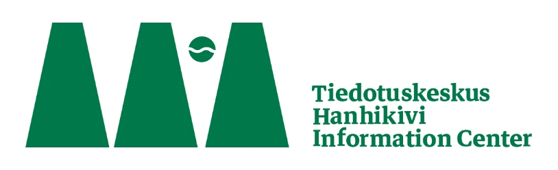

**Kutsu taiteilijoille ja tutkijoille / tieteen ja taiteen tekijöille**

Osuuskunta Noidanlukko ja Tiedotuskeskus Hanhikivi kutsuvat eri tieteen
ja taiteen alojen tekijöitä tutkimaan kukin oman alansa keinoin ihmisen
luontosuhdetta ja Pyhäjoelle suunnitellun ydinvoimalan vaikutuksia
ympäristöön. Etsimme ryhmiä, yksilöitä, tutkimushankkeita ja verkostoja
sekä pyrimme yhteistyöhön riippumattomien tahojen kanssa.

Tarjoamme residenssityyppistä toimintaa Tiedotuskeskus Hanhikiven
talolla;

erityisesti tilat soveltuvat jaksoittaiseen pienryhmätyöskentelyyn,
työpajoihin,

journalistiseen ja dokumentointityöhön, pieniin näyttelyihin ja
tapahtumiin.

***Haku vuodelle 2020 on avoinna 31.3.2020 saakka.\
\
**Voit lähettää hakemuksen sähköpostilla: infocenterhanhikivi
(at)riseup.net. Lue kuitenkin ensin tämä kutsu kokonaan.\
\
Tiedotuskeskus Hanhikiven toimintamahdollisuudet riippuvat sitä
hallinnoivan Osuuskunta Noidanlukon osuuksien myynnistä.
Tiedotuskeskuksen talo sijaitsee Pyhäjoen keskustan tuntumassa ja
tarjoaa tilaa majoittumiseen ja tapahtumia varten. Kesäaikaan myös
piha-aluetta voi hyödyntää. Tiedotuskeskus Hanhikiven toiminta rakentuu
yhteisin ponnistuksin, ja esim. ruoka- ja polttopuukuluista on pieni
päiväkohtainen maksu. Ruoka-, lämmitys- ja yöpymiskulut ovat noin 9-
15e/vrk riippuen tilanteesta.*

*Tätä kutsua voi mielellään jakaa, ja olet tervetullut mukaan yhteiseen
projektiimme!*

Tervetulleita ovat taiteen ja tieteen ammattilaiset, mutta myös kenen
tahansa ideasta, ryhmän osaamisesta, tutkimisen halusta, ilmaisun
tarpeesta tai pelkästä intuitiosta lähtevät projektit. Tärkeintä on,
että voit kuvata projektisi, tavoitteesi tai toimesi etukäteen ja
projekti voidaan hyväksyä kuuluvan Osuuskunta Noidanlukon tavoitteisiin
ja Tiedotuskeskus Hanhikiven käytännön sääntöihin. Osuuskunta
Noidanlukko on kiinnostunut esimerkiksi eri alojen
ympäristönsuojeluprojekteista, ympäristön tilan mittaamiseen sekä
ympäristössä tapahtuvien muutosten dokumentointiin liittyvistä
hankkeista.\
\
Tiedotuskeskus Hanhikiven tavoitteena on oppia sekä tiedottaa entistä
paremmin

ydinvoimalahankkeen yhteiskunnalle ja luonnolle aiheuttamista
vahingoista. Etsimme keinoja, joilla korjata joitakin Pyhäjoella
aiheutettuja vahinkoja. Hakukuulutuksemme koskee toisaalta myös työtä,
jolla nostaa esiin ydinvoimalaprojektin aiheuttamia laajempia ongelmia,
kuten mm. taloudellinen kannattamattomuus, riippuvuus
ydinvoimateollisuudesta, ekologisten vaihtoehtojen syrjäyttäminen, sorto
ja vahinko ihmisiä, luontoa sekä valtioiden välistä rauhaa kohtaan.
Hanhikivenniemelle tulisi laatia vaihtoehtoisia, ekologista
energiantuotantoa tukevia suunnitelmia, esimerkiksi tuuli-, aurinko- ja
biomassaenergiaan tukeutuen sekä Ruotsin kanssa yhteistä merialuetta
hyödyntäen ja suojellen.

**Osuuskunta Noidanlukko voi tarjota:**

• Tiedotuskeskus Hanhikiven tuen resurssien mukaan

• tapahtumia ja tilaisuuksia Pyhäjoella ja lähialueella, joiden
yhteydessä toteuttaa

taidetta ja tutkimusta, kerätä ja jakaa tietoa

• pihapiirin, jossa toteuttaa ekologisesti kestävään elämäntapaan
perustuvia kokeiluja

• naapurisopua, luontoa ja eläimiä kunnioittavaa toimintaa

• ilmapiiriä, joka kannustaa kansalaisia keräämään itse tietoa ja
toimimaan aktiivisesti

• asennetta, jossa kaikki ovat tasa-arvoisia oppijoita, kokemuksen ja
tiedon jakajia

• verkkosivut, joiden kautta tuoda esille ydinvoimakriittistä tietoa

Kannustamme luovuuteen, huumoriin, poikkitaiteellisuuteen ja
-tieteellisyyteen. Mukaan haluavien tahojen tulee hyväksyä Osuuskunta
Noidanlukon tavoitteet ja periaatteet. Voimme tarjota tukemme
projekteille, jotka kestävät enintään vuoden 2021 loppuun asti.

Osuuskunta Noidanlukolla ei ole palkattua työvoimaa, se ei voi luvata
taloudellista tukea ja kukin projektia toteuttava taho on viime kädessä
itse vastuussa tekemästään työstä.

Osuuskunta kuitenkin tarjoaa tilat, verkostonsa, tukensa
yleishyödylliseen työhön ja luottamuksensa ihmisen kekseliäisyyteen
kääntää hyväksikäyttävät koneistot

toimimaan ekologisesti ja tulevien sukupolvien hyväksi.

**Vastaa seuraaviin kysymyksiin vapaamuotoisen hakukirjeen muodossa:**

1\. Projektin nimi, sen toteuttajat ja vastuuhenkilöt, ja haetaanko
projektin toteuttamiseen muita ihmisiä mukaan?

2\. Projektin tieteellinen/taiteellinen/muu tausta (esim. kuuluuko jonkin
organisaation projekteihin, mitä tahoja siinä on mukana, onko taustalla
jokin selkeä tavoite/rahoitus/päämäärä)

3\. Projektin sisältö pääpiirteittäin, mm. mitä tehdään, kenelle, miksi
ja milloin?

4\. Mitä haluat saavuttaa projektillasi, onko siinä selkeä tulos tai
suunta, jota haetaan?

5\. Mitä tukea toivoisit osuuskunnalta/osuuskunnan hallitukselta/
tiedotuskeskukselta/alueen ihmisiltä/alueen järjestöiltä (esim.
kansalaisten keräämiä uutisjuttuja, tapahtumajärjestelyä tm.)

6\. Mihin työsi tulos (esitys, tutkimus, teksti, juttu jne\...) on
tarkoitus päätyä?

7\. Oletko kiinnostunut osallistumaan muuhun osuuskunnan toimintaan?
Talolla ollessa kaikki osallistuvat omalta osaltaan ruokahuoltoon,
kierrätykseen, siivoukseen jne., mutta onko sinulla jokin työpaja,
luento, jonka haluaisit toteuttaa osuuskunnan piirissä?

8\. Oletko kiinnostunut osuuskunnan jäsenyydestä?

9\. Yhteystietosi

Osuuskunta Noidanlukko

infocenterhanhikivi(at)riseup.net

<https://hanhikivi.center/>
