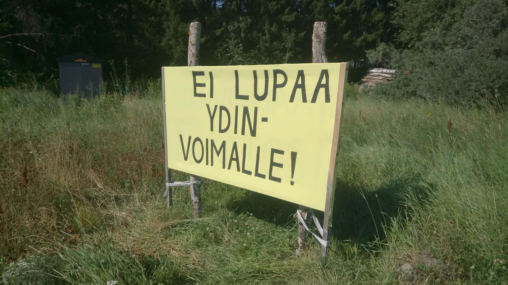
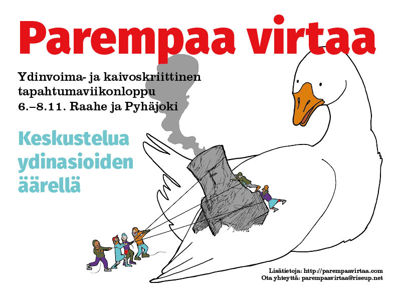

Pyhäjoella, Parhalahden kylässä, 8-tien varressa pohjoiseen päin mennessä on vasemmalla puolella paikka banderollille.  Banderolli on tämän vuoden kevään jälkeen kaatunut ja on nyt maassa. Banderollin koko on(koko n 3 m x1,5m)

 

## Olemme päättäneet uusia banderollin. Mikä olisi viestimme? 

Banderolli tehdään kestävälle materiaalille ja alla oleva hanhi on ehdotus kuvapohjaksi. 

Meillä on lupa kuvan käyttöön ja taiteilija lisää haluamamme tekstin kuvaan. Nyt kaipaamme teiltä tekstiehdotuksia. 

Esimerkiksi? 
- Ei lupaa Fennovoimalle! Ajetaan ydinvoima alas!
- Ei lupaa ydinvoimalle! Yhteistyöllä Fennovoima alas!
- 

