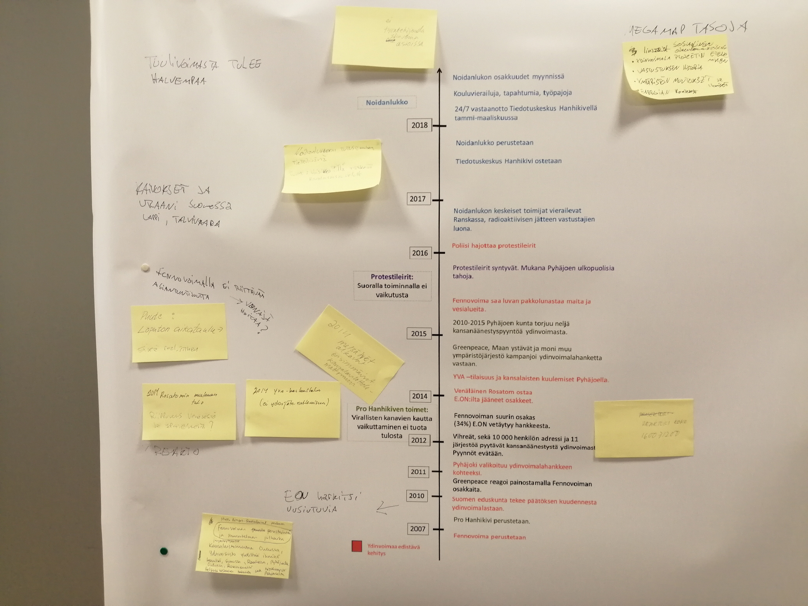

## Aikajanatyöpaja 

Aikajanatyöpajassa käytiin läpi koettua historiaa Pyhäjoen ydinvoimalahankkeeseen liittyen. Paikallaolijoilla oli hyvin erilaisia kokemuksia vuosien varrelta, ja aikajanalle aseteltiin esimerkiksi kansalaistoimintaa, ympäristömuutoksia ja poliittisia päätöksiä.

