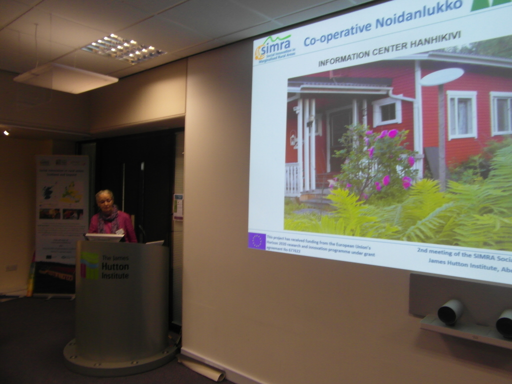

# Toinen SIMRA:n sosiaalisen innovoinnin asiantuntijaryhmän kokous, Aberdeen, Iso-Britanniassa, 14.-17. Lokakuuta 2019.

Suomesta osallistuivat Simo Sarkki, Oulun Yliopistosta ja Lea Launokari  Osuuskunta Noidanlukosta.
2nd Meeting of the SIMRA Social Innovation Think Tank, Aberdeen, United Kingdom 14th to 17th October 2019.
Simo Sarkki and Lea Launokari participated from Finland.

[Download the presentation here](./files/SIMRA-SITT-Meeting-Aberdeen-October-2019-Lea Launokari-Noidanlukko.ppt)

